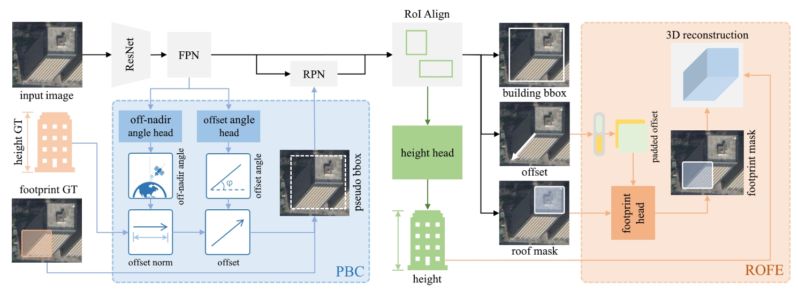

<div align="center">
	<h1>3D Building Reconstruction from Monocular Remote Sensing Images with Multi-level Supervisions</h1>
	<a href="https://arxiv.org/abs/2404.04823"></a>
	<a href=""></a>
	<a href=""></a>
</div>



## 📜 Introduction

This repository contains the official codes for MLS-BRN (CVPR 2024), our multi-level supervised building reconstruction network that can flexibly utilize training samples with different annotation levels.

- We design MLS-BRN, a multi-level supervised building reconstruction network, which consists of new tasks and modules to enhance the relation between different components of a building instance and alleviate the demand on 3D annotations.
- We propose a multi-level training strategy that enables the training of MLS-BRN with different supervision levels to further improve the 3D reconstruction performance.
- We extend the monocular building reconstruction datasets to more cities. Comprehensive experiments under different settings demonstrate the potential of MLS-BRN in large-scale cross-city scenarios.

Please check out our [paper](https://openaccess.thecvf.com/content/CVPR2024/html/Li_3D_Building_Reconstruction_from_Monocular_Remote_Sensing_Images_with_Multi-level_CVPR_2024_paper.html) for further details.

## 🔧Installation

We inherit the environement of [BONAI](https://github.com/jwwangchn/BONAI/tree/master), and here is a reference to deploy it:

```bash
# create & activate environment
conda create -n mlsbrn python=3.8
conda activate mlsbrn

# install pytorch-1.11.0 
pip install torch==1.11.0+cu113 torchvision==0.12.0+cu113 torchaudio==0.11.0 --extra-index-url https://download.pytorch.org/whl/cu113

# install dependency packages
pip install mmcv-full==1.7.0 -f https://download.openmmlab.com/mmcv/dist/cu113/torch1.11.0/index.html
cd MLS-BRN/
pip install -v -e .
pip install yapf==0.40.1

# install wwtool package for evaluate code
git clone https://github.com/jwwangchn/wwtool.git
cd wwtool
python setup.py develop
# install bstool package for evaluate code
git clone https://github.com/Hoteryoung/bstool.git
cd bstool
git pull origin modify_for_loft-foa-fro
git checkout modify_for_loft-foa-fro
python setup.py develop
```

## ⬇️Data Preparation

Please download [BONAI](https://github.com/jwwangchn/BONAI/tree/master) and our proposed [dataset](https://opendatalab.com/OpenDataLab/MLS-BRN)，then put the datasets into one directory and specify the directory as `data_root` variable in `configs/_base_/datasets/bonai_instance_hfm_ssl.py`.

## 🔥Train & Test

The config files are defined in ``configs/_base_/models/bonai_loft_foahfm_r50_fpn_basic.py`` and `configs/_base_/schedules/schedule_2x_bonai.py`. We provide shell scripts for training and test in `tools/`.

To train or test the model in different environments, modify the given shell script and config files accordingly.

Note: you need to specify the dataset as `CITY` variable in `tools/dist_test.sh` when testing.

```bash
cd MLS-BRN/
# for non-slurm system
# train
./tools/dist_train.sh loft_foahfm_ssl loft_foahfm_r50_fpn_2x_bonai_ssl
# resume training from a checkpoint
./tools/dist_train.sh loft_foahfm loft_foahfm_r50_fpn_2x_bonai --resume-from='path to checkpoint'
# test & evaluate, <timestamp> refers to the timestamp of the training results folder in ./work_dirs/
./tools/dist_test.sh loft_foahfm_r50_fpn_2x_bonai_ssl <timestamp>

# for slurm system
# train
./tools/slurm_train.sh loft_foahfm loft_foahfm_r50_fpn_2x_bonai
# test & evaluate 
./tools/slurm_test.sh loft_foahfm_r50_fpn_2x_bonai_ssl <timestamp>
```

## 😊Citation

If you use our dataset, codebase or models in your research, please consider cite.

```
@InProceedings{Li_2024_CVPR,
    author    = {Li, Weijia and Yang, Haote and Hu, Zhenghao and Zheng, Juepeng and Xia, Gui-Song and He, Conghui},
    title     = {3D Building Reconstruction from Monocular Remote Sensing Images with Multi-level Supervisions},
    booktitle = {Proceedings of the IEEE/CVF Conference on Computer Vision and Pattern Recognition (CVPR)},
    month     = {June},
    year      = {2024},
    pages     = {27728-27737}
}
```
